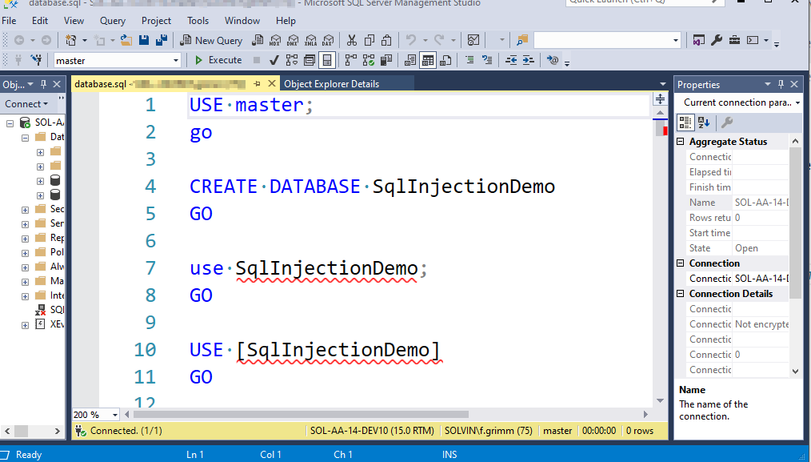
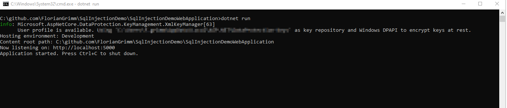
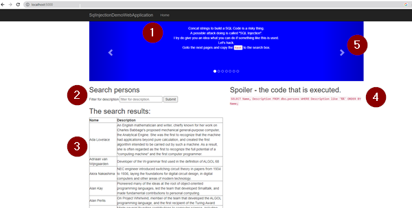

# SqlInjectionDemo
What is SQL Injection? Try it out.

So you will never ever use unsafe dynamic SQL code.

```csharp
sqlcode = $"SELECT Name, Description FROM dbo.persons WHERE Description like '%{filter}%' ORDER BY Name;";
```

vs

```csharp
filter = $"%{filter}%";
sqlcode = "SELECT Name, Description FROM dbo.persons WHERE Description like @filter ORDER BY Name;";
command.Parameters.Add(new SqlParameter("@filter", filter));
```

# Install

1) Clone the repository
2) Create the database using the file SqlInjectionDemoWebApplication\database.sql. Just open the file in the Microsoft SQL Server Management Studio, and Execute.

3) Configure the ConnectionString in the SqlInjectionDemoWebApplication\appsettings.json
4) Start the WebApplication local.
```cmd
cd SqlInjectionDemoWebApplication
dotnet run 
```

5) Open the Browser at http://localhost:5000/
6) foreach page
    1) read the instructions in the blue area.
    2) set the filter - Submit to execute the sql
    3) the results
    4) the executed sql 
    5) goto the next page

7) Please use SqlParameter. Please do not insert your unverified web request parameter value into dynamic SQL Code anymore.

8) If you really want to use safe dynamic SQL Code, you can use fixed SQL snippets without using dynamic

Example 1:

```csharp
var filterBy = "Description";
var filterValue = "a";
var sortBy = "Description";
string sqlcode = "SELECT Name, Description FROM dbo.persons ";
if (string.IsNullOrEmpty(filterBy)){
} else if (filterBy == "Name"){
    sqlcode = sqlcode + " WHERE Name like @filterValue";
} else if (filterBy == "Description"){
    sqlcode = sqlcode + " WHERE Description like @filterValue";
} 
if (sortBy == "Description"){
    sqlcode = sqlcode + " ORDER BY Description;";
} else {
    sqlcode = sqlcode + " ORDER BY Name;";
}

command.Parameters.Add(new SqlParameter("@filterValue", filterValue));
```

Here you have dynamic constructed SQL code, but it's safe.
Different values for filterBy and sortBy results in different SQL statements.


Example 2:
You can build invalid sql statements - but you cannot inject values from the outside into your statement

Good: you don't leak any data.
Bad: Your users find the bug.
```csharp
if (sortBy == "Description"){
    sqlcode = sqlcode + " ORDER BY Description;";
} else {
    sqlcode = sqlcode + " ORDER BY Id;";
}

command.Parameters.Add(new SqlParameter("@filterValue", filterValue));
```

Example 3:

BAD: excuse "but it works"
REALLY BAD: you may be in trouble if someone finds this.
```csharp
sqlcode = sqlcode + $" ORDER BY {sortBy};"; // Iznogood
```


Happy coding
Flori